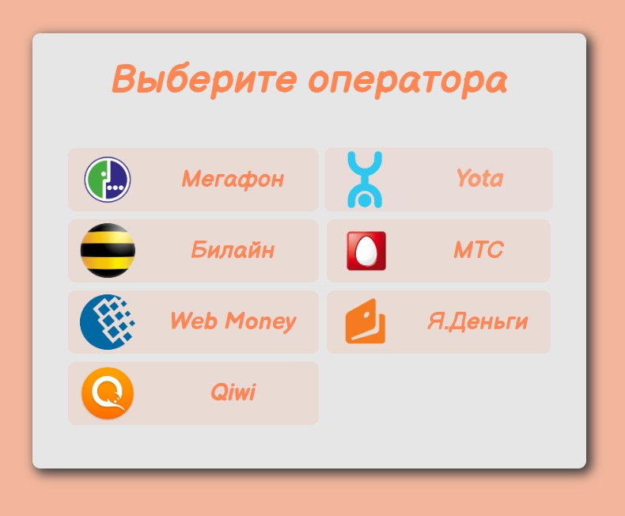
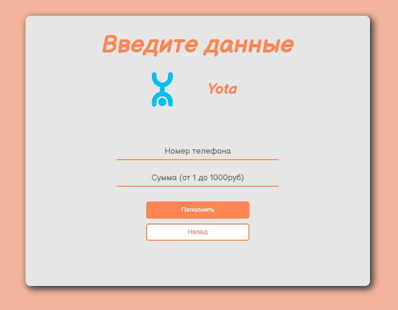

# Тестовое задание для Brave Developers
## Задача
Web приложение - терминал оплаты мобильного телефона.
В приложении должен быть главный экран со списком операторов - МТС, Билайн,
Мегафон. Список должен быть расширяем. По клику на оператора переходить на
экран формы оплаты.
Экран с формой оплаты должен содержать выбранного оператора, поле ввода
телефона с маской и валидацией, и поле ввода суммы в рублях с маской и
валидацией (мин 1 и макс 1000 руб). Кнопка подтверждения, которая ожидает ответа
от сервера. После ответа показывается сообщение об успехе или об ошибке. В случае
успеха переходим на основной экран.
## Итоговый результат:
### >>> [Ссылка на демо](https://isildurrr1.github.io/test-brave-developers/) <<<

